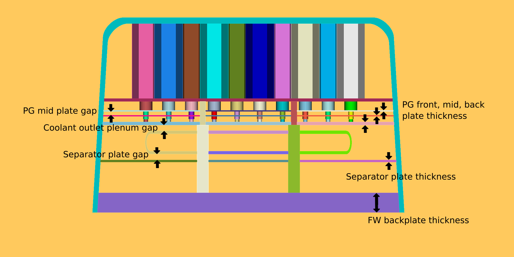
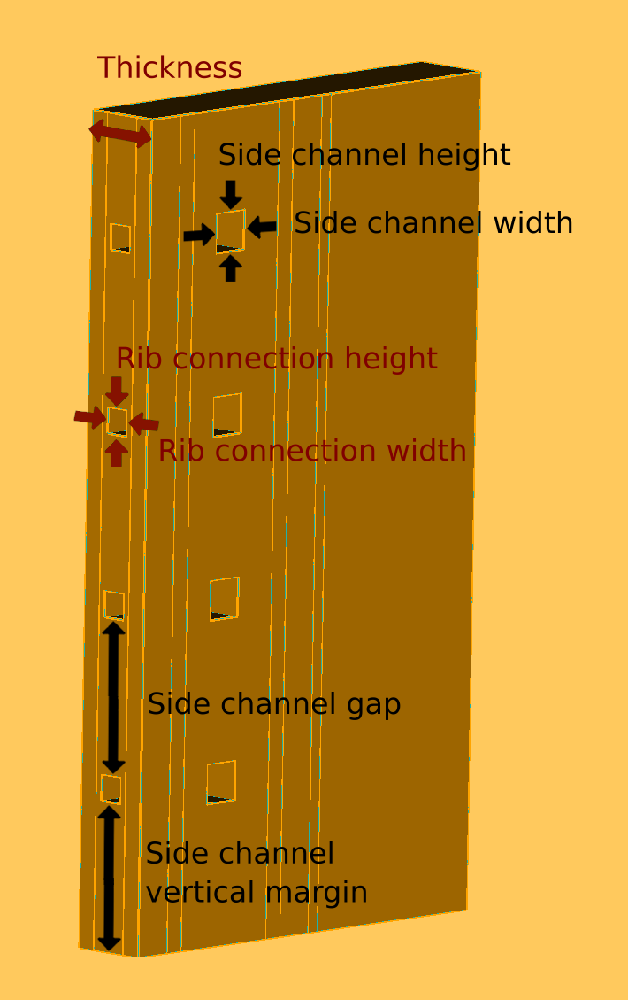
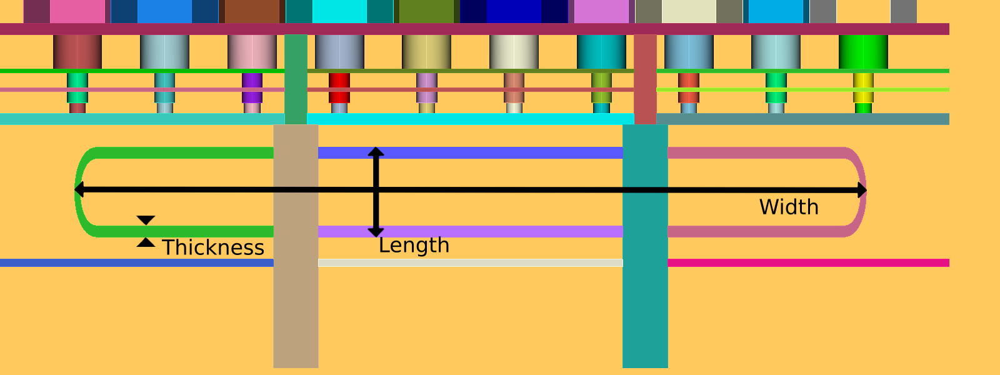

HCPB blanket
============

The HCPB-style blanket was based off the blanket design from the following paper:

Zhou, G.; Hernández, F.A.; Pereslavtsev, P.; Kiss, B.; Retheesh, A.; Maqueda, L.; Park, J.H.
The European DEMO Helium Cooled Pebble Bed Breeding Blanket:
Design Status at the Conclusion of the Pre-Concept Design Phase.
Energies 2023, 16, 5377. https://doi.org/10.3390/en16145377

This assembly has the ``class`` key ``hcpb_blanket``. An example is given in ``examples/sample_blanket.json``.
The HCPB blanket has assembly-level geometrical parameters and individual components.
These individual components have their own materials and geometrical parameters.

The assembly-level geometrical parameters are shown in the images below. They are labelled in black in :ref:`blanket_params`,
and in maroon in :ref:`rib_params`.

.. _blanket_params:

    Blanket-level parameters

.. _rib_params:

    Rib parameters

The components that need to be described as part of this assembly are:

* :doc:`HCPB first wall`
* :doc:`HCPB pin`
* Front rib: This has the ``class`` key ``front_rib``. The geometrical parameters are labelled in black in :ref:`rib_params`.
* Back rib: This has the ``class`` key ``back_rib``. The geometrical parameters are labelled in black in :ref:`rib_params`.
* Coolant outlet plenum: This has the ``class`` key ``coolant_outlet_plenum``. The geometrical parameters are shown in :ref:`cop_params`.
  
.. _cop_params:

    
    Coolant outlet plenum parameters