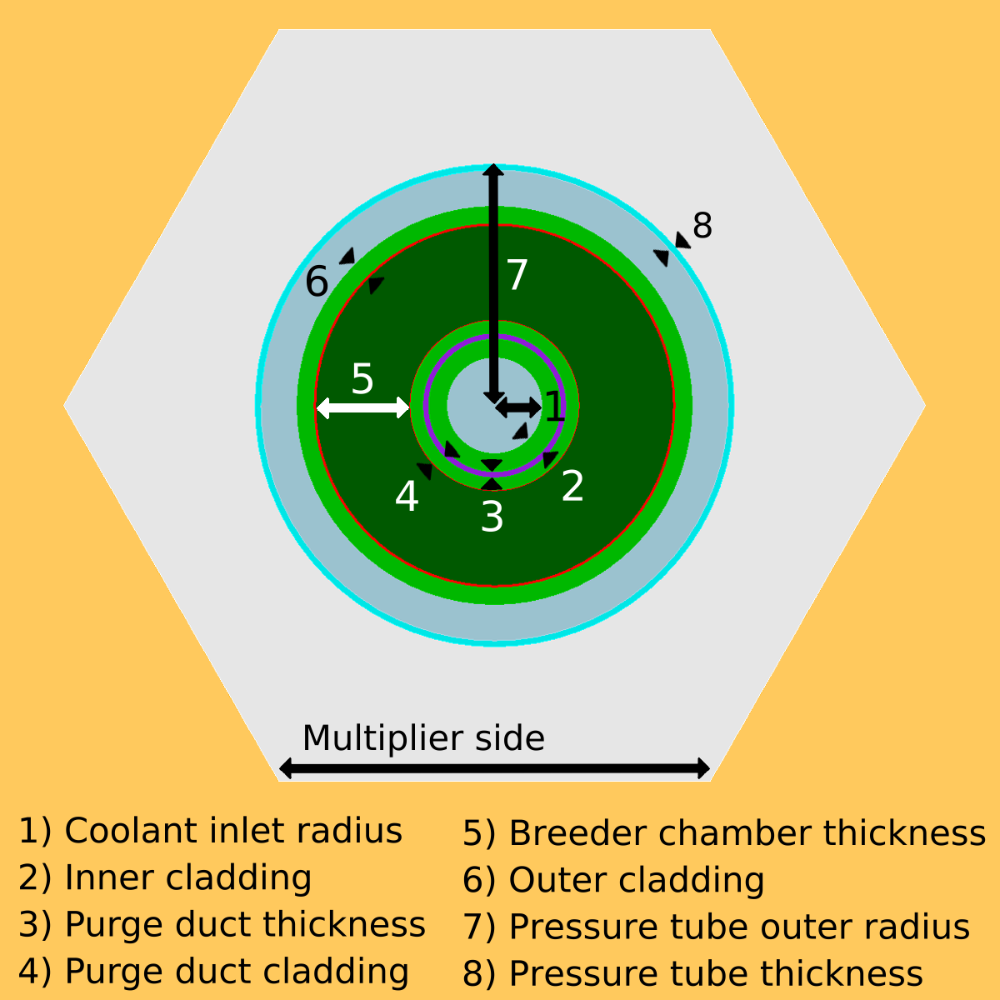

HCPB pin
========

The HCPB-style pin was based off the pin design from the following paper:

Zhou, G.; Hernández, F.A.; Pereslavtsev, P.; Kiss, B.; Retheesh, A.; Maqueda, L.; Park, J.H.
The European DEMO Helium Cooled Pebble Bed Breeding Blanket:
Design Status at the Conclusion of the Pre-Concept Design Phase.
Energies 2023, 16, 5377. https://doi.org/10.3390/en16145377

This assembly has the ``class`` key ``pin``. An example is given in ``examples/sample_pin.json``.
The following images show the geometrical parameters for the HCPB-style pin.

    Axial pin parameters
    

    Radial pin parameters